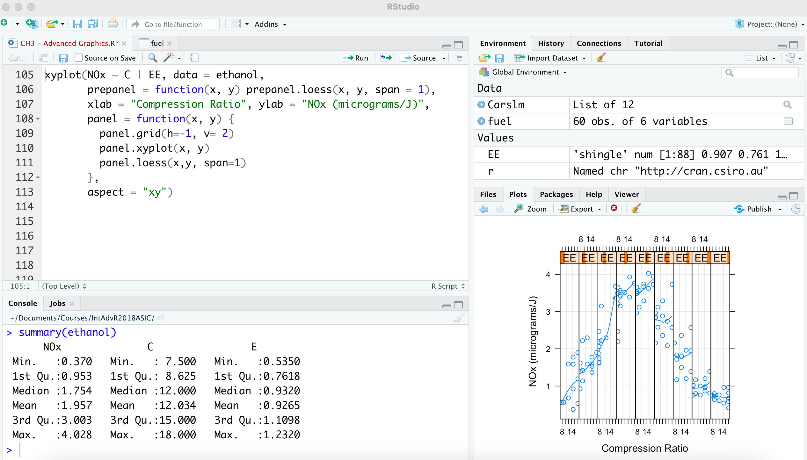

```{r setup, include=FALSE}
knitr::opts_chunk$set()

def.chunk.hook  <- knitr::knit_hooks$get("chunk")
knitr::knit_hooks$set(chunk = function(x, options) {
  x <- def.chunk.hook(x, options)
  paste0("\n \\", "footnotesize","\n\n", x, "\n\n \\normalsize")
})
```

# Introduction

## Introduction

- Introduction to Applied Data Science

- Overview of this class:

  - Basics of Programming
  
  - Data Wrangling
  
  - Visualization: Tables and Graphs
  
  - Getting and Cleaning Data
  
  - Understanding Machine Learning algorithms
  
  - Writing reports & collaborating effectively
  
  - Ethics of AI
  
## About Me

- Bas Machielsen

- Assistant Professor Applied Economics

- Research: Economic History (Lots of messy data!), Political Economy

- Background in Economics, Data Science, Coding experience in R and Python


## Syllabus Highlights

- The course contains: 

  - Introduction to arguably the most user-friendly way of programming
  
  - Integrating Data Collection and Data Cleaning
  
  - Introduction to the most fundamental machine learning algorithms to analyze data
  
  - Writing reports of your analyses using RMarkdown
  
  - Collaborating effectively using GitHub

## Syllabus Highlights [2]

- After this course:

  - Data collection will _never_ be frustrating again
  
  - You will be able to independently gather, manipulate and wrangle datasets
  
  - You will be able to analyze and visualize your data
  
  - You will be able to deal with errors and read documentation

## Why Data Science?

- Data science is an exciting discipline that allows you to turn raw data into understanding, insight, and knowledge. 

- Our model of the tools needed in a typical data science project looks something like this:

```{r, echo = FALSE, out.width="50%", fig.align='center'}
knitr::include_graphics('data-science.png')
```

- First you must import your data into R.

- This typically means that you take data stored in a file, database, or web application programming interface (API), and load it into a data frame in R. 
  - We will introduce you to all of these cases here. 

## Why Data Science? [2]

- Once you’ve imported your data, it is a good idea to **tidy** it. 

- Tidying your data means storing it in a consistent form:
  - _Variables_ in Columns
  - _Observations_ in Rows
  
- Example:
  ```{r echo = TRUE, message = FALSE}
  library(tidyverse)
  mtcars %>% select(1:5) %>% head(5)
  ```

## Why Data Science? [3]

- Once you have tidy data, a common first step is to transform it.

- Transformation includes:
  - Narrowing in on observations of interest (like all people in one city, or all data from the last year) 
  - Creating new variables that are functions of existing variables (like computing speed from distance and time)
  - Calculating a set of summary statistics (like counts or means). 
  
- Together, tidying and transforming are called **data wrangling**

- One of the most underrated aspects of data science and one of the most useful skills you might learn

## Why Data Science? [4]

- Once data is cleaned and organized, you usually want to **visualize** it. 

- A good vizualisation allows you to interpret will show you things that you did not expect, or raise new questions about the data. 

- After initial visualization, we usually proceed to **analyze** the data using various appropriate models.
  - These models might come from _economic theory_, _econometrics_, or _machine learning_. 

- The last step of data science is **communication**, an absolutely critical part of any data analysis project. 
- It doesn’t matter how well your models and visualisation have led you to understand the data unless you can also communicate your results to others

## Why R? 

- R is in the process of becoming the most important data science language

- Also in Economics, where it is (likely) replacing **Stata** (a paid alternative)

- I think this is partially due to its **ease to learn** and **user friendliness**
  - Even though you might not agree when you are frustrated! 
  
- Newcomers to R are often surprised by the degree of choice — some would say fragmentation — within the language.
  - We'll be using a _user-friendly_ approach to R specifically fine-tuned towards data wrangling and cleaning

## Why R? [2]

- We'll use a set of packages called **tidyverse** 

  - The documentation and community support are outstanding.
  
  - Having a consistent philosophy and syntax makes it easy to learn.
  
  - Provides a convenient “front-end” to big data tools that we will cover later in the book.
  
  - For data cleaning, wrangling, and plotting, the tidyverse offers some important improvements over base R
  
  - In a different course, you will get a more general introduction to R
  
## Why R? [3]

- A short preview of what R can do:

```{r echo = TRUE, warning = FALSE, message = FALSE, out.width = "50%", fig.align='center'}
library(ggplot2)

ggplot(data = mtcars, aes(x = wt, y = mpg)) + 
  geom_smooth(method = "lm", col = "red") + 
  geom_point()
```

## Why R? [4]

```{r, warning = FALSE, message = FALSE}
pacman::p_load(palmerpenguins, modelsummary)
penguins <- palmerpenguins::penguins

datasummary(All(penguins) ~ sex*(mean + sd + N), penguins)
```

## Why R? [5]

```{r, message = F, warning = F, cache = TRUE}
pacman::p_load('gganimate', 'wbstats', 'tidyverse', 'gifski')
countries <- wb_countries() %>% select(iso3c, region)
data <- wb_data(c('SP.DYN.LE00.IN', 'NY.GDP.PCAP.CD', 'SP.POP.TOTL')) %>%
  left_join(countries)

plot <- ggplot(data, aes(x = log(NY.GDP.PCAP.CD), y = SP.DYN.LE00.IN, 
                 size = SP.POP.TOTL, colour = country)) +
  geom_point(alpha = 0.7, show.legend = FALSE) + 
  facet_wrap(~region) +
  labs(title = 'Year: {frame_time}') +
  transition_time(as.integer(date)) + ease_aes('linear')


```

## Why R? [6]

```{r eval = FALSE}
plot
```

\begin{center}
\animategraphics[autoplay,loop,height=6cm]{4}{gganim_plot0}{001}{100}
\end{center}


## Grading

- The course will feature three individual assignments and one final exam. 

- All assignments have to be handed in.

- Assignments will ask you to _write_ and _finish_ code, analyze data, interpret output, all while tackling a real-world problem

- You will use Rstudio and RMarkdown to report your work. 

- The exam will test some of your comprehension of the _concepts_ behind the code, but you are not asked to write code.
  - It will also focus on the machine learning elements.
  - You are frequently asked to interpret code output. 

# Introduction to RStudio

## RStudio

- RStudio is an IDE (Integrated Development Environment) for R

- This is what RStudio looks like:

```{r out.width = "60%", echo = FALSE, fig.align='center'}

```

## RStudio

- RStudio containts four subscreens (three if you haven't opened an R script yet)

- The upper left screen is a script - usually a `.R` file or an `.Rmarkdown` file 
  - You write and save your code up here
  
- The bottom left is the console
  - The console is asking you "What should I do next?": this is an open R session
  - You can use it to e.g. install packages, and try out stuff
  
- The upper right contains various tabs, the most important of which is the **environment**
  - This stores all the objects you have made
  
- The bottom right contains an Explorer, and a Graphics Viewer


## Objects and Functions

- Some basic principles of R: 

1. Everything is an object - data.frames, functions, strings, URLs

2. Everything has a name - and you call and mention objects by their name

3. You do things using functions. They require inputs and outputs in certain formats

4. Functions come pre-written in packages (i.e. "libraries"). You can — and should — write your own functions too.


## Some Useful Libraries

- Before proceeding to do anything in RStudio, it is useful to download and install two packages. 

- The first is a package manager, which allows you to either load or install packages, depending on whether it is already installed
  - Many students include things like `install.packages()` in their code, which prompts R to (re-)install the package every time the code is run. 
  - The package manager is called `pacman`. To install it, use:  

```{r echo = TRUE, warning = FALSE}
if (!require("pacman")) install.packages("pacman")
pacman::p_load(tidyverse)
```

## Some Useful Libraries [2]

- Secondly, if you're using Windows, `Rtools` allows you to install packages faster and more efficiently. To install `Rtools`, now use: 

```{r echo = TRUE, eval = FALSE}
pacman::p_load(Rtools)
```

- We'll come across much more packages later. Sometimes, you might forget to load a package. In that case, you might get an Error like:

```
Error in function() : could not find function "function"
```

- Which is a clue that you should load the correct package. 

- In addition, it is a safe strategy to the `package::function` interface, so as to explicitly use a particular function from a particular package. 


## Rstudio is not only for R

- RStudio has evolved from being something exclusively used with R to a tool that can be used for more programming languages
  - In particular, it is sometimes very useful to use R and Python interchangeably. 

- To install a Python implementation _using R_, you can first install the `reticulate` package:

```{r echo = TRUE, eval = FALSE}
install.packages('reticulate')
```

- By default, reticulate uses the version of Python found on your system. If you don't have Python, you can install it using:

```{r echo = TRUE, eval = FALSE}
reticulate::install_python()
```

- Then, you can load: `{r eval = FALSE} library(reticulate)`, and run:

```{python}
import numpy as np
np.sum([1,2,3])
```

## Rstudio is not only for R


