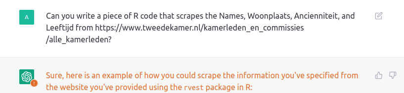
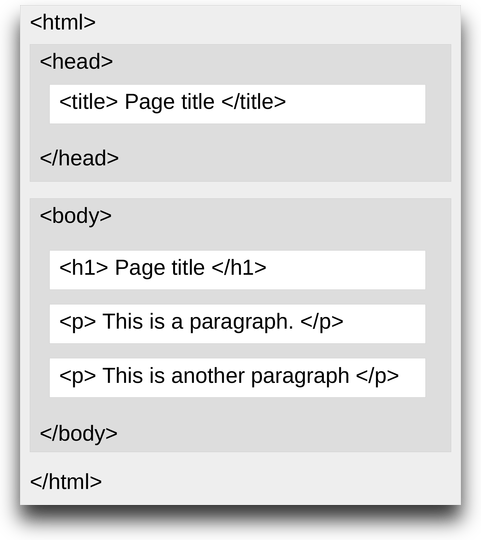
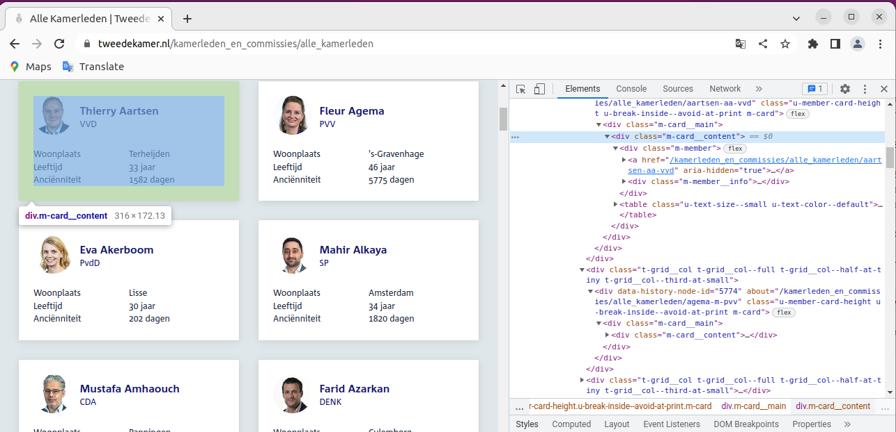
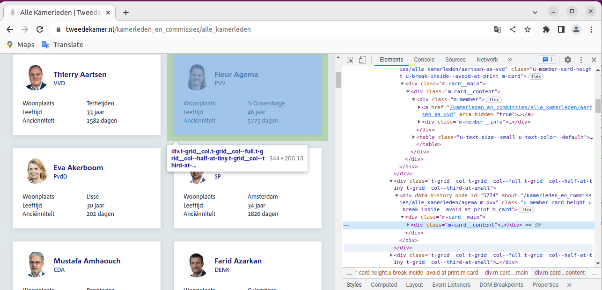

```{r setup, include=FALSE}
library(tidyverse, quietly = TRUE)
library(rvest, quietly = TRUE)

knitr::opts_chunk$set()

def.chunk.hook  <- knitr::knit_hooks$get("chunk")
knitr::knit_hooks$set(chunk = function(x, options) {
  x <- def.chunk.hook(x, options)
  paste0("\n \\", "tiny","\n\n", x, "\n\n \\normalsize")
})
```

# Lecture 4: Web Scraping

## Introduction

- Many of you might have heard of ChatGPT:


> ChatGPT (Generative Pre-trained Transformer) is a chatbot launched by OpenAI in November 2022. It is built on top of OpenAI's GPT-3 family of large language models, and is fine-tuned (an approach to transfer learning) with both supervised and reinforcement learning techniques. 

- What does it do? 


> While the core function of a chatbot is to mimic a human conversationalist, journalists have also noted ChatGPT's versatility and improvisation skills, including its ability to write and debug computer programs; to compose music, teleplays, fairy tales, and student essays; to answer test questions (sometimes, depending on the test, at a level above the average human test-taker); to write poetry and song lyrics; to emulate a Linux system; to simulate an entire chat room; to play games like tic-tac-toe; and to simulate an ATM.

## Suppose we are interested in this data..

- [Source](https://www.tweedekamer.nl/kamerleden_en_commissies/alle_kamerleden)

```{r, echo = FALSE, out.width="70%", fig.align='center'}

```


## What happens if we ask ChatGPT?


```{r, echo = FALSE, out.width="80%", fig.align='center'}

```

## This is the output


```{r, out.height="80%"}
# Scrape the webpage
url <- "https://www.tweedekamer.nl/kamerleden_en_commissies/alle_kamerleden"
webpage <- read_html(url)

# Extract the table containing the data
table <- html_nodes(webpage, "table") %>% .[[1]]

# Extract the rows of the table
rows <- html_nodes(table, "tr")

# Extract the data from each row
data <- lapply(rows, function(x) {
  name <- html_text(html_nodes(x, ".member-name"))
  woonplaats <- html_text(html_nodes(x, ".member-place-of-residence"))
  ancienniteit <- html_text(html_nodes(x, ".member-seniority"))
  leeftijd <- html_text(html_nodes(x, ".member-age"))
  data.frame(Name=name, Woonplaats=woonplaats, Ancienniteit=ancienniteit, Leeftijd=leeftijd)
})

# Bind the data together
data <- bind_rows(data)

```

- Let us briefly take a look at the intended logic of the code

## This is the output

```{r}
data
```

- The code doesn't work!

- But it's a pretty good start 

- Let us first correct the code, and then see step by step what happens

## This is the corrected output

- This is the corrected code 

```{r}
library(rvest, quietly = TRUE)

# Scrape the webpage
url <- "https://www.tweedekamer.nl/kamerleden_en_commissies/alle_kamerleden"
webpage <- read_html(url)

# Extract the table containing the data pieces
table <- html_nodes(webpage, "div.m-card__content")

# Extract the data from each member
data <- lapply(table, function(x) {
  name <- html_text(html_nodes(x, "a.m-member__name"))
  party <- html_text(html_nodes(x, "span.m-member__subtitle"))
  wal <- html_text(html_nodes(x, "td"))
  if(length(wal) == 2) { 
    woonplaats <- NA
    leeftijd <- wal[1]
    ancienniteit <- wal[2]
  } else {
  woonplaats <- wal[1]
  leeftijd <- wal[2]
  ancienniteit <- wal[3]
   }
  
  data.frame(Name=name, Partij=party, Woonplaats=woonplaats, 
             Ancienniteit=ancienniteit, Leeftijd=leeftijd)
})

# Bind the data together
data <- bind_rows(data)
```


## Correct Code

- In comparison to the incorrect code offered to us by ChatGPT, we changed a couple of things:

- We changed the table object from:

```{r eval = FALSE}
table <- html_nodes(webpage, "table") %>% .[[1]]
```

to: 

```{r eval = FALSE}
table <- html_nodes(webpage, "div.m-card__content")
```

- And we changed the function to pick up `Woonplaats, Ancienniteit` and `Leeftijd` more carefully. 

## Results

- This code gives you the following dataset:

```{r}
data %>% head(10)
```


- In this lecture, we'll learn how to scrape data from websites using the `rvest` package.
  - And we can always use ChatGPT to give us a starting point

## Demonstration

- Let's see if we can do something nice with this newly obtained dataset. 

```{r}
library(tmap, quietly = TRUE); library(sf, quietly = TRUE)
```

```{r}
data("NLD_muni")
freq <- data %>% group_by(Woonplaats) %>% summarize(count = n())
NLD_muni <- NLD_muni %>% left_join(freq, by = c("name" = "Woonplaats"))
```

```{r, out.height="40%", fig.align='center'}
NLD_muni %>% ggplot() + geom_sf(alpha=0.7,aes(fill=count)) + scale_fill_continuous(type='viridis') 
```

## Demonstration

```{r, warning = FALSE, out.height="60%", fig.align='center'}
data %>% 
  group_by(Partij) %>%
  summarize(ma = mean(parse_number(Ancienniteit))) %>%
  ggplot(aes(x = Partij, y = ma)) + geom_col(aes(fill = Partij)) + 
  theme(axis.text.x = element_text(angle = 90, vjust = 0.5, hjust=1),
        legend.position="none")
```

# Introduction to Web Scraping

## Introduction to Web-Scraping

- To do web scraping, you need to know some basic HTML. 

- HTML stands for “Hyper Text Markup Language”. HTML page consists of series of elements which browsers use to interpret how to display the content. HTML tags are names of the elements surrounded by angle brackets like so: `<tagname>` content goes here... `</tagname>`. 

- Most HTML tags come in pairs and consist of opening and a closing tag, known as start tag and end tag, where the end tag name is preceded by the forward slash `/`.


## HTML Structure

- Below is a visualization of a simple HTML page structure:

```{r, echo = FALSE, out.height="50%", out.width="40%", fig.align='center'}

```

- Pretty much all webpages look like this
  - But there are exceptions

## HTML Structure

- It is possible to define HTML attributes inside HTML tags.

- Attributes provide additional information about HTML elements, such as hyperlinks for text, and width and height for images. 

- Attributes are always defined in the start tag and come in `name="value"` pairs, like so: `<a href="https://www.example.com">This is a link</a>`
  - Here `href` is the attribute and it's value is `"https://www.example.com"`

## CSS Selectors

- CSS is a language that describes how HTML elements should be displayed. 

- One of the ways to define useful shortcuts for selecting HTML elements to style is CSS selectors. 

- CSS selectors represent patterns for locating HTML elements.

- This is what we use to find particular attributes in a HTML page, and extract them or their text into R

## Example

- If we focus once again the the Dutch Lower House website, right-click with your mouse and then select `Inspect (Q)`

- A subscreen will pop-up with the html code underlying the website

- Your job is then to find the elements you want to scrape, and find the pattern. 

## Example

- Let us revisit some excerpts from the (correct) code from above:

```{r eval = FALSE}
# Extract the table containing the data pieces
table <- html_nodes(webpage, "div.m-card__content")

# Extract the data from each member
data <- lapply(table, function(x) {
  name <- html_text(html_nodes(x, "a.m-member__name"))
  party <- html_text(html_nodes(x, "span.m-member__subtitle"))
  wal <- html_text(html_nodes(x, "td")) } )
```


## Example

- - By inspecting the website, we can see that each politician is featured inside a `<div>` with the `attribute m-card__content`:

```{r, echo = FALSE, out.width="60%", fig.align='center'}

```

## Example


```{r, echo = FALSE, out.width="60%", fig.align='center'}

```


## Example

- Hence, this part of the code:

```{r eval = FALSE}
# Extract the table containing the data pieces
table <- html_nodes(webpage, "div.m-card__content")
```

- is finding _all the nodes_ which contain the information about the politician. 

- This part of the code:

```{r eval = FALSE}
data <- lapply(table, function(x) {
  name <- html_text(html_nodes(x, "a.m-member__name"))
  party <- html_text(html_nodes(x, "span.m-member__subtitle"))
  wal <- html_text(html_nodes(x, "td")) } )
```

- is looping through all the 150 unique politicians, and getting the `text` from _all_ nodes that are `<a class="m-member__name">`, `<span class="m-member__subtitle">` and `<td>`. 

- In the first two cases, there is only 1 element each. In the case of `<td>`, there are more. Hence the rest of the code. 

# Another Example: Wikipedia

## Wikipedia Example


